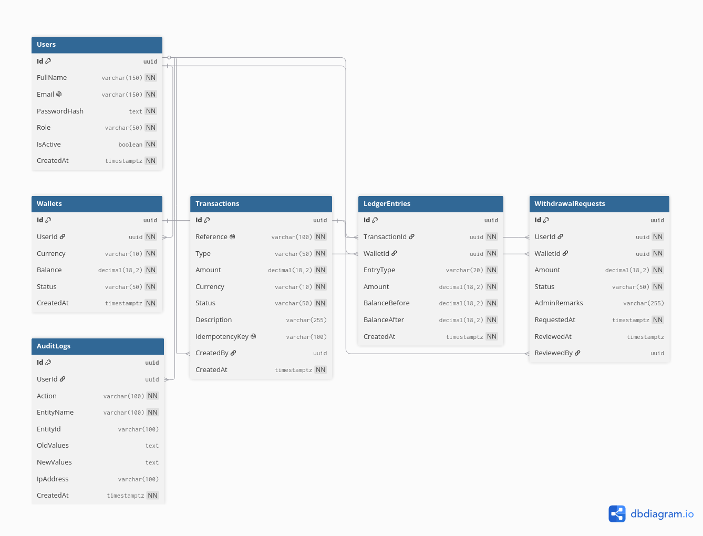

# TranzaPay

Fintech wallet and ledger API built with ASP.NET Core, EF Core, PostgreSQL, JWT auth, Swagger, Docker, and a minimal admin panel.

## Features

- User registration and login
- Auto-created USD wallet after registration
- Deposit simulation with idempotency key support
- Wallet-to-wallet transfers
- Withdrawal requests with admin approval or rejection
- Double-entry ledger entries for deposits, transfers, and approved withdrawals
- Transaction history
- Audit logs
- Role-based access for `User` and `Admin`
- Background service that monitors pending withdrawals

## ER Diagram



## Run Locally


Open:

- API: `http://localhost:8080`
- Swagger: `http://localhost:8080/swagger`

Seed admin:

```text
admin@tranzapay.local
Admin123!
```

## Run Without Docker

Start PostgreSQL locally, then:

```bash
dotnet run --project TranzaPay.Api/TranzaPay.Api.csproj
```

The API uses `ConnectionStrings:DefaultConnection`. Environment-variable form:

```bash
ConnectionStrings__DefaultConnection="Host=localhost;Port=5432;Database=tranzapay;Username=postgres;Password=postgres"
Jwt__Secret="change-this-secret-in-production-at-least-32-chars"
```

## Database Creation

The API calls EF Core `EnsureCreated` on startup. That means it will create the tables automatically when it can connect to the configured PostgreSQL database.

With Docker Compose, the `postgres` service creates the `tranzapay` database from `POSTGRES_DB=tranzapay`, and the API creates the tables.

For a local or hosted PostgreSQL server, create the database first if your database user does not have permission to create databases. The API will still create the tables inside that database.

## API Modules

- `POST /api/auth/register`
- `POST /api/auth/login`
- `GET /api/wallets`
- `POST /api/deposits/simulate`
- `POST /api/transfers`
- `POST /api/withdrawals`
- `GET /api/withdrawals`
- `GET /api/transactions`
- `GET /api/admin/wallets`
- `GET /api/admin/withdrawals/pending`
- `POST /api/admin/withdrawals/{id}/review`
- `GET /api/admin/transactions`
- `GET /api/admin/audit-logs`

## Ledger Model

TranzaPay seeds a system treasury wallet. Every money movement writes balanced ledger entries:

- Deposit: system wallet debit, user wallet credit
- Transfer: sender wallet debit, receiver wallet credit
- Approved withdrawal: user wallet debit, system wallet credit

Balance mutations happen inside serializable EF Core database transactions, and debit entries prevent negative balances.
